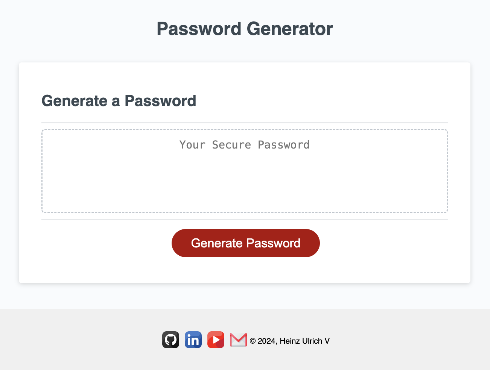
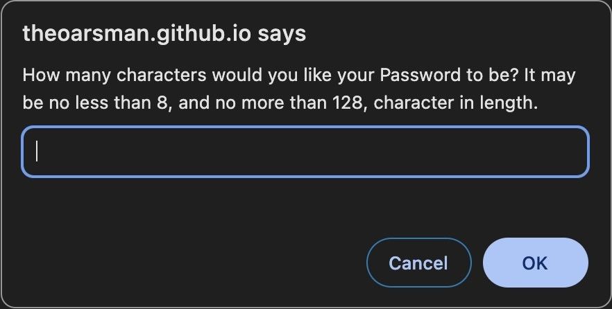
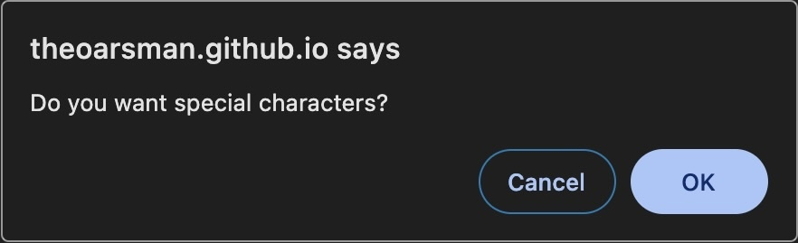
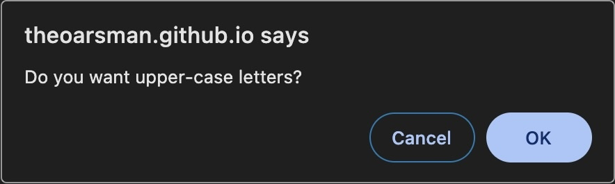
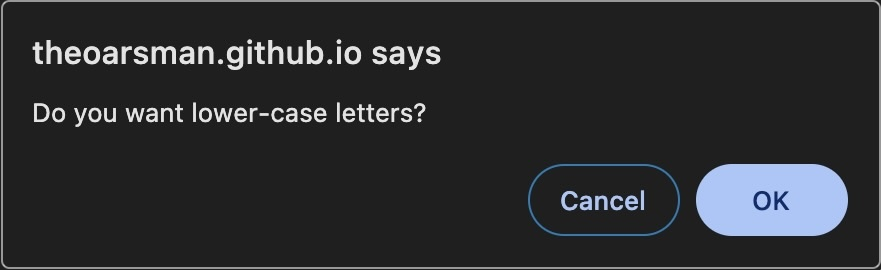
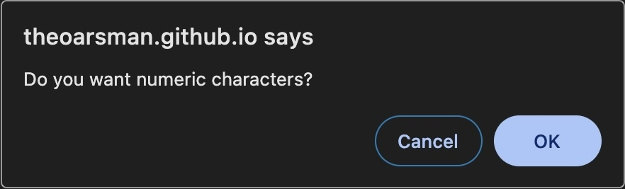

## Rodnam Proswasd Gnereotar

[Rodnam Proswasd Gnereotar](https://theoarsman.github.io/Rodnam-Proswasd-Gnereotar/)

## Description

This page displays Challenge #3 for our <a href="https://bootcamp.msu.edu/coding/">Coding Bootcamp</a> course.

The task was to create a Random Password Generator. Reading the title of this repository may seem odd and misspelled. However, it was done purposefully. Long story short, humans read words as a whole rather than individual letters. So, as long as the first and last letters are in the correct space, the order of the remaining letter don't matter. You will still be able to read the word. Yeah, I'm a little goofy.

When started, a series of prompts appear asking what you like like as the criteria for your password: 

- Length 8-128 characters
- Special Characters
- Lower/Upper Case Letters
- Numerics 

Based on your selections, a random password will be generated for you!

## Table of Contents

- [Rodnam Proswasd Gnereotar](#Rodnam-Proswasd-Gnereotar) 
- [Description](#description) 
- [iPad Application](#ipad-application) 
- [iPhone Application](#iphone-application) 
- [Table of Contents](#tabel-of-contents) 
- [User Story](#user-story) 
- [Acceptance Criteria](#acceptance-criteria) 
- [Installation](#instllation) 
- [Development](#development) 
- [Usage](#usage) 
- [Technologies](Technologies)
- [License](#license) 
- [Contributing](#contributing) 
- [Tests](#tests) 
- [Resources](#resources) 
- [Questions/Contact](#questionscontact)

## User Story

**AS AN** employee with access to sensitive data 

**I WANT** to randomly generate a password that meets certain criteria 

**SO THAT** I can create a strong password that provides greater security 

## Acceptance Criteria

**GIVEN** I need a new, secure password 

**WHEN** I click the button to generate a password 
**THEN** I am presented with a series of prompts for password criteria 

**WHEN** prompted for password criteria 
**THEN** I select which criteria to include in the password 

**WHEN** prompted for the length of the password 
**THEN** I choose a length of at least 8 characters and no more than 128 characters 

**WHEN** asked for character types to include in the password 
**THEN** I confirm whether or not to include lowercase, uppercase, numeric, and/or special characters 

**WHEN** I answer each prompt 
**THEN** my input should be validated and at least one character type should be selected 

**WHEN** all prompts are answered 
**THEN** a password is generated that matches the selected criteria 

**WHEN** the password is generated 
**THEN** the password is either displayed in an alert or written to the page

## Code Example

Here are two examples I used within my script.js to determine what characters could be used, and also to create a threshold for the min/max number of characters.

For the JavaScript, here is the array created to specify what character options are and what each contains:

- https://github.com/TheOarsman/Rodnam-Proswasd-Gnereotar/blob/9e3f437c743e08a63aef7eec6735c6e147443dfb/script.js#L1-L4

For the threshold of characters allowed to be used, I entered the below script. One tricky part was getting it to recognize when something other than a number was entered for the quantity, and to correct the error or throw up an Alert.

- https://github.com/TheOarsman/Rodnam-Proswasd-Gnereotar/blob/9e3f437c743e08a63aef7eec6735c6e147443dfb/script.js#L12-L27
